# LG Aimers 6기: 난임 환자 대상 임신 성공 여부 예측

> 난임 치료 데이터를 기반으로 환자의 임신 성공 여부를 예측하는 이진 분류 모델 개발 프로젝트입니다.  
> 불균형 데이터, 범주형 변수, 대회 제출 환경을 고려해 전처리-검증-튜닝-후처리 파이프라인을 설계했습니다.

## 1. Project Overview

| 항목 | 내용 |
| --- | --- |
| 대회 | LG Aimers 6기 해커톤 |
| 주제 | 난임 환자 대상 임신 성공 여부 예측 |
| 문제 유형 | Binary Classification |
| 평가 지표 | ROC-AUC |
| 주요 역할 | 전처리, 불균형 샘플링 실험, 모델 비교, Optuna 튜닝, 제출 파일 생성 |
| 핵심 모델 | LightGBM, XGBoost, CatBoost |

## 2. Problem Definition

난임 치료 데이터는 시술 정보, 환자 상태, 배아 관련 변수처럼 의료 도메인 특성이 강한 범주형/수치형 변수를 포함합니다. 목표는 단순 정확도보다 양성/음성 클래스의 순위를 안정적으로 구분하는 것이므로 ROC-AUC를 기준으로 모델을 비교했습니다.

이 프로젝트에서는 다음 세 가지 문제를 중점적으로 다뤘습니다.

- 클래스 불균형으로 인한 양성 클래스 예측 성능 저하
- 범주형 변수와 결측치가 많은 의료 데이터의 안정적인 전처리
- Public/Private 제출 환경에서 과적합을 줄이기 위한 교차검증 기반 튜닝

## 3. Data & Preprocessing

원본 데이터는 대회 제공 파일을 사용했으며, 라이선스와 재배포 제한을 고려해 저장소에는 포함하지 않았습니다. 재현 시 `data/` 디렉터리에 아래 파일을 배치해야 합니다.

```text
data/
  train.csv
  test.csv
  sample_submission.csv
```

전처리 단계는 노트북 기준으로 다음 흐름을 따릅니다.

1. `ID` 컬럼 제거
2. 단일 값만 갖는 컬럼과 전부 결측치인 컬럼 제거
3. 결측치 처리 및 범주형 변수 인코딩
4. 학습/검증 분할 대신 `StratifiedKFold` 기반 5-fold 검증 적용
5. 클래스 불균형 대응을 위해 기본 학습, RandomOverSampler, SMOTE, 언더샘플링 계열 실험 비교

## 4. Modeling Strategy

트리 기반 부스팅 모델을 중심으로 실험했습니다. 의료/대회형 테이블 데이터에서 강한 기준선이 되는 LightGBM, XGBoost, CatBoost를 동일한 교차검증 조건에서 비교했고, ROC-AUC 상위 조합을 대상으로 Optuna 튜닝을 진행했습니다.

```mermaid
flowchart LR
    A["Raw CSV"] --> B["Column Filtering"]
    B --> C["Missing Value Handling"]
    C --> D["Categorical Encoding"]
    D --> E["5-Fold Stratified CV"]
    E --> F["Sampling Strategy Test"]
    F --> G["Model Comparison"]
    G --> H["Optuna Tuning"]
    H --> I["Full Train + Inference"]
    I --> J["Rule-based Postprocessing"]
```



### Key Decisions

- **ROC-AUC 중심 검증**: 클래스 비율에 민감한 정확도보다 순위 품질을 보는 ROC-AUC를 기준으로 모델을 선별했습니다.
- **불균형 대응 실험**: 모델 내 `scale_pos_weight`, `is_unbalance`, `auto_class_weights`와 오버샘플링/SMOTE를 함께 비교했습니다.
- **Optuna 단계적 탐색**: RandomSampler로 넓게 탐색한 뒤 TPESampler로 정밀 탐색하는 방식으로 튜닝 효율을 높였습니다.
- **도메인 규칙 후처리**: 학습 데이터에서 특정 조건의 성공 여부가 항상 0으로 관측된 경우 제출 확률을 0으로 보정했습니다.

## 5. Postprocessing

최종 제출 코드에서는 학습 데이터에서 관찰된 규칙을 기반으로 아래 조건의 예측 확률을 0으로 보정했습니다.

- `시술 당시 나이`가 `알 수 없음`으로 인코딩된 케이스
- `배아 생성 주요 이유`가 `난자 저장용` 또는 `기증용`인 케이스

이 후처리는 모델이 포착하기 어려운 명시적 도메인 패턴을 제출 단계에서 반영하기 위한 장치입니다.

## 6. Repository Structure

```text
.
├── README.md
├── requirements.txt
├── src/
│   └── train.py
├── notebooks/
│   ├── LG_AImers_6기_우리오디가_제출코드.ipynb
│   ├── README.md
│   └── experiments/
│       ├── 전처리변경_안나누기_lgbm튜닝더.ipynb
│       └── 전처리변경_안나누기_lgbm튜닝더_원본.ipynb
└── docs/
    └── project-summary.md
```

## 7. How to Reproduce

```bash
pip install -r requirements.txt
python src/train.py
```

실행 전 대회 데이터 파일을 `data/` 디렉터리에 배치해야 합니다. 실행 결과로 제출 파일은 `data/최종제출본.csv` 경로에 생성됩니다. 원본 실험 흐름은 `notebooks/`에서 확인할 수 있습니다.

## 8. What I Learned

- 검증 셋 하나의 점수보다 Stratified K-Fold 평균 점수로 모델을 비교하는 것이 제출 안정성에 더 유리했습니다.
- 불균형 데이터에서는 샘플링만으로 성능이 보장되지 않으며, 모델별 클래스 가중치와 함께 비교해야 했습니다.
- 의료 도메인 데이터는 결측치 자체가 의미를 가질 수 있어, 단순 삭제보다 컬럼의 분포와 타깃 관계를 먼저 확인하는 과정이 중요했습니다.
- 최종 성능은 모델 복잡도보다 전처리, 검증 설계, 후처리 규칙의 일관성이 크게 좌우됐습니다.

## 9. References

- [LG Aimers](https://www.lgaimers.ai/)
- [DACON](https://dacon.io/)
- [프로젝트 회고 글](https://pmq0328.tistory.com/7)
