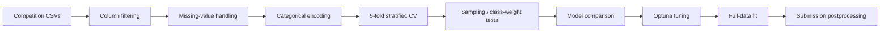

# LG Aimers 6th Pregnancy Prediction

Machine-learning competition project for predicting pregnancy success from fertility-treatment tabular data, documented as a non-clinical portfolio artifact.

## Overview

This repository organizes a LG Aimers 6th competition solution around a binary classification task: estimate the probability of pregnancy success from structured fertility-treatment records. The public repository is intended for reviewer inspection of the modeling workflow, not for clinical use.

| Item | Details |
| --- | --- |
| Domain | Fertility-treatment / medical-adjacent tabular prediction |
| Task | Binary classification |
| Competition metric | ROC-AUC |
| Main models | LightGBM, XGBoost, CatBoost |
| Main contribution | preprocessing, feature handling, validation design, imbalance experiments, Optuna tuning, submission generation |
| Public reproducibility | inspection-first; full rerun requires competition CSV files that are not redistributed |

## Problem

Fertility-treatment records combine procedure history, patient-state fields, embryo-related attributes, missing values, and categorical treatment codes. The competition objective was to rank pregnancy-success likelihood for submission scoring, while the portfolio objective is to show how the modeling pipeline handled imbalanced, sensitive, medical-adjacent tabular data responsibly.

The practical challenge was not to create clinical advice. It was to build a stable competition pipeline with cautious validation, clear data-publication limits, and no unsupported medical claims.

## Role

My work focused on the end-to-end modeling pipeline:

- cleaned low-signal columns such as constants and fully missing features;
- designed missing-value handling for treatment-specific fields;
- encoded categorical treatment and history features for tree-based models;
- compared LightGBM, XGBoost, and CatBoost under the same 5-fold validation setup;
- tested class-imbalance strategies, including model class weights, random oversampling, and SMOTE;
- tuned top candidates with Optuna and generated submission files;
- separated the reusable script in `src/train.py` from exploratory notebooks under `notebooks/`.

This was a competition and portfolio project, not a deployed product or clinical decision-support system.

## Data

The original `train.csv`, `test.csv`, and `sample_submission.csv` files were provided for the competition. They are intentionally excluded from this repository because the dataset is domain-sensitive and may be subject to competition redistribution limits.

Expected local layout for an authorized rerun:

```text
data/
  train.csv
  test.csv
  sample_submission.csv
```

Public boundary:

- raw competition data is not included;
- generated submission CSVs are not included;
- Drive scratch/copy notebooks and data folders are excluded from the review path;
- the repository documents methodology and provides code, but does not publish patient-level records or claim clinical validity.

## Validation

The project uses ROC-AUC because the target is imbalanced and ranking quality matters more than a fixed probability threshold for the competition objective.

Validation design:

1. remove identifier columns and uninformative features;
2. process missing values and treatment-specific feature groups;
3. encode categorical variables with `OneHotEncoder(handle_unknown="ignore")`;
4. evaluate candidate models with 5-fold `StratifiedKFold`;
5. compare baseline class-imbalance treatments;
6. tune the strongest model/sampling combination with Optuna;
7. train the selected model and write the submission probability file.

Tracked experiment notebooks record cross-validation results around ROC-AUC 0.74 for tuned LightGBM-style experiments. Treat those as competition-validation evidence only; they are not external validation, prospective validation, or clinical performance evidence. The `notebooks/experiments/` folder is not blanket public-safe evidence because it contains an `_원본.ipynb` original-copy notebook that still requires user review before publication.

## Model

The final public script, `src/train.py`, keeps the competition workflow in a cleaner form:



Model choices were intentionally conservative for tabular competition data:

- **LightGBM / XGBoost / CatBoost**: strong gradient-boosted tree baselines for heterogeneous structured features.
- **Class-imbalance handling**: model-native weights plus oversampling variants were compared instead of assuming one imbalance strategy.
- **Optuna tuning**: randomized search followed by TPE search narrowed hyperparameters for the selected candidate.
- **Postprocessing**: observed deterministic treatment conditions were applied at submission time, but these rules are documented as competition heuristics, not medical rules.

More detail is available in [`docs/modeling-or-method.md`](docs/modeling-or-method.md).

## Reproduce

Install dependencies:

```bash
pip install -r requirements.txt
```

Run the script after placing authorized competition CSV files in `data/`:

```bash
python src/train.py
```

Expected output:

```text
data/최종제출본.csv
```

Because the raw dataset is not public, reviewers can still inspect:

- `src/train.py` for the cleaned training pipeline;
- `notebooks/LG_AImers_6기_우리오디가_제출코드.ipynb` for the competition submission flow;
- reviewed notebooks only after user confirmation; `notebooks/experiments/` currently contains an `_원본.ipynb` blocker and should not be treated as public-safe or inspectable evidence yet;
- `docs/project-summary.md` and `docs/modeling-or-method.md` for reviewer-oriented notes.

## Evidence

Cleared evidence available in this repository after the current docs review:

- implementation artifact: [`src/train.py`](src/train.py);
- final submission notebook: `notebooks/LG_AImers_6기_우리오디가_제출코드.ipynb`;
- project notes: [`docs/project-summary.md`](docs/project-summary.md);
- modeling notes: [`docs/modeling-or-method.md`](docs/modeling-or-method.md).

Publication blocker: `notebooks/experiments/` contains a tracked `_원본.ipynb` original-copy notebook. Do not present that folder or the `_원본.ipynb` notebook as public-safe evidence until the user reviews and either confirms, sanitizes, renames, or removes it.

Local portfolio QA evidence is stored outside the repo under `.omo/evidence/practitioner-github-portfolio/`.

## Ethical and Non-Clinical Use

This repository is a non-clinical machine-learning competition portfolio project. It must not be used to advise patients, rank treatment options, predict an individual's outcome for care decisions, or replace medical judgment.

Ethical boundaries:

- pregnancy and fertility data is sensitive health-adjacent information;
- public documentation avoids patient-level examples and raw records;
- validation is limited to competition-style retrospective splits;
- no fairness, subgroup safety, calibration, deployment monitoring, or clinical review has been completed;
- any real-world use would require domain expert review, data-governance approval, external validation, and clear consent/legal basis.

## Limitations

- Full reproduction is blocked unless the reviewer already has authorized access to the competition data.
- Cross-validation is retrospective and may not represent future clinics, patient groups, treatment protocols, or data-collection processes.
- ROC-AUC does not prove calibrated probabilities or clinically actionable thresholds.
- Postprocessing rules are competition heuristics inferred from available fields; they should not be interpreted as medical knowledge.
- The repository intentionally excludes raw data, generated CSVs, Drive scratch/copy notebooks, and private artifacts.
- No deployment, monitoring, privacy threat model, or clinical safety evaluation is included.

## References

- [LG Aimers](https://www.lgaimers.ai/)
- [DACON](https://dacon.io/)
- [Project write-up](https://pmq0328.tistory.com/7)
